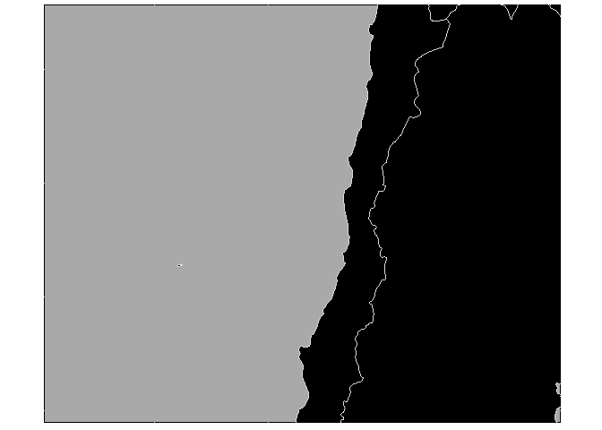
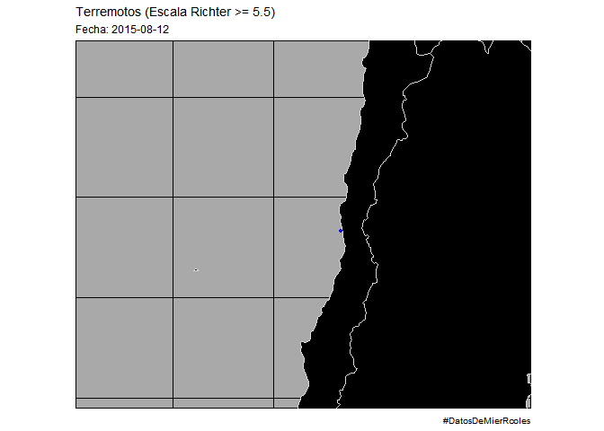
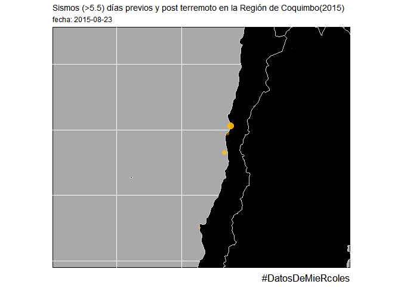
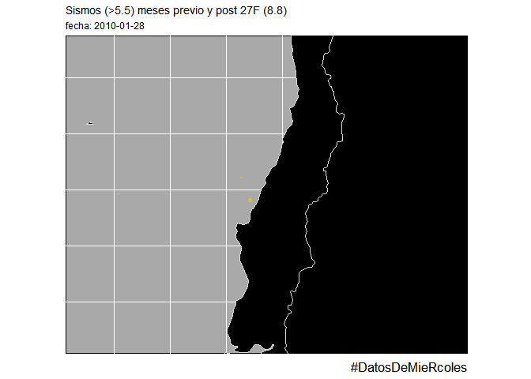

Terremoto Coquimbo,Chile 2015
================

Primero obtener los datos desde el repo de
\#DatosDeMieRcoles

``` r
terremotos <- readr::read_csv("https://raw.githubusercontent.com/cienciadedatos/datos-de-miercoles/master/datos/2019/2019-05-29/terremotos.csv")
```

### Ploteando la capa mundo

Buscar las coordenadas de la zona a plotear  
Para Coquimbo usar `xlim = c(-83.826, -63.204),ylim = c( -23.037,
-39.669)` dentro de `coord_sf()`

``` r
library("rnaturalearth")
world <- ne_countries(scale = "medium", returnclass = "sf")
library(ggplot2)
library(ggthemes)
library(tidyverse)
ggplot() +
  borders("world", colour = "gray85", # color limites de paises
           fill = "black") +  # color de la tierra
  coord_sf( xlim = c(-83.826, -63.204),ylim = c( -23.037, -39.669))+ 
    theme_map()+
    theme(panel.grid.major = element_line(colour = "darkgrey"), # lineas del grid
          panel.background = element_rect(fill = "darkgrey"))   # fondo
```

<!-- -->

### Preparando los datos

#### Escala Richter

Para visualizar mejor los diferentes sismos transformar la escala
Richter con logaritmo
(<http://matematicasentumundo.es/NATURALEZA/naturaleza_Richter.htm>) :

``` r
terremotos <- terremotos %>%   filter( tipo == "terremoto" ) %>% 
  mutate(energia =10^(11.8 + 1.5 *magnitud) )
```

| esquina      | lat      | long     |
| ------------ | -------- | -------- |
| superior izq | \-23.037 | \-83.826 |
| inf derecha  | \-39.669 | \-63.204 |
| en R         | ylim     | xlim     |

``` r
# Verificando el dia del terremoto
terremotos %>% filter(fecha == "2015-09-16") %>%  arrange(desc(magnitud))
```

    ## # A tibble: 12 x 8
    ##    fecha      hora   latitud longitud tipo     profundidad magnitud energia
    ##    <date>     <drtn>   <dbl>    <dbl> <chr>          <dbl>    <dbl>   <dbl>
    ##  1 2015-09-16 22:54   -31.6     -71.7 terremo~        22.4      8.3 1.78e24
    ##  2 2015-09-16 23:18   -31.6     -71.4 terremo~        28.4      7   2.00e22
    ##  3 2015-09-16 22:59   -31.6     -71.7 terremo~        26.7      6.4 2.51e21
    ##  4 2015-09-16 07:40     1.88    126.  terremo~        41.6      6.3 1.78e21
    ##  5 2015-09-16 14:03    -6.01    151.  terremo~         6        6.1 8.91e20
    ##  6 2015-09-16 23:03   -31.8     -71.7 terremo~        19.1      6.1 8.91e20
    ##  7 2015-09-16 23:16   -31.6     -71.9 terremo~        35        6.1 8.91e20
    ##  8 2015-09-16 23:38   -31.8     -72.0 terremo~        12.5      5.9 4.47e20
    ##  9 2015-09-16 23:09   -31.6     -71.7 terremo~        35        5.7 2.24e20
    ## 10 2015-09-16 23:23   -31.2     -71.8 terremo~        32.1      5.7 2.24e20
    ## 11 2015-09-16 23:09   -31.1     -71.4 terremo~        37.8      5.6 1.58e20
    ## 12 2015-09-16 23:28   -30.7     -71.8 terremo~        20.7      5.5 1.12e20

``` r
terremoto_coquimbo <- terremotos %>% 
  filter(fecha > "2015-07-16" & fecha < "2015-11-16") %>%  
  filter(latitud < -23.037 & latitud > -39.669) %>% 
  filter( longitud < -63.204 & longitud > -83.826 )


dim(terremoto_coquimbo) # 51 obs
```

    ## [1] 51  8

``` r
library(ggthemes)
library(gganimate)


terremoto_coquimbo %>%  ggplot() +
  borders("world", colour = "gray85", # color limites de paises
           fill = "black") +  # color de la tierra
  coord_sf( xlim = c(-83.826, -63.204),ylim = c( -23.037, -39.669))+ 
    theme_map()+
    theme(panel.grid.major = element_line(colour = "white"), # lineas del grid
          panel.background = element_rect(fill = "darkgrey")) +
  geom_point(aes(x = longitud, y = latitud, size = energia, colour= magnitud),
             alpha= 0.9) +
  scale_colour_gradientn(colours = c("blue", "green", "yellow", "orange", "red"))+
  scale_size_continuous(range = c(1,80))+
  theme(legend.position = "none")+  
  # DESDE AQUÍ SE ANIMA!
  transition_states(fecha, wrap = F, transition_length = 0)+
  labs(title = "Terremotos (Escala Richter >= 5.5)", subtitle = "Fecha: {closest_state}", caption = "#DatosDeMierRcoles")
```

<!-- -->

En el plot anterior no se aprecian correctamente los sismos pre y post
terremotos porque hay días que no se registran sismos, esto hace que la
gráfica pierda “ritmo”.

## Rellenar los días sin sismos

``` r
relleno <- data.frame(fecha =seq(as.Date("2015-07-16"), as.Date("2015-11-16"), "days") )


terremoto_coquimbo1<- dplyr::full_join(terremoto_coquimbo, relleno , by ="fecha") %>% 
  arrange(fecha) %>%
  replace(., is.na(.), 0) %>% 
  filter(fecha >= "2015-08-23" & fecha <= "2015-10-10")

#PLOTEANDO (EL FINAL)

gif_cqb <- terremoto_coquimbo1 %>%  ggplot() +
    borders("world", colour = "gray85", # color limites de paises
             fill = "black") +  # color de la tierra
    coord_sf( xlim = c(-83.826, -63.204),ylim = c( -23.037, -39.669))+ 
      theme_map()+
      theme(panel.grid.major = element_line(colour = "white"), # lineas del grid
            panel.background = element_rect(fill = "darkgrey"),
            plot.caption = element_text(size = 13),
            legend.position = "none") +
    geom_point(aes(x = longitud, y = latitud, size = energia, colour= magnitud),
               alpha= 0.9) +
    scale_colour_gradientn(colours = c("blue", "green", "yellow", "orange",  "red"))+
    scale_size_continuous(range = c(2,140))+
    #DESDE AQUÍ SE ANIMA!
    transition_states(fecha, wrap = F, transition_length = 0)+
    shadow_wake(0.4)+ # para que los puntos salgan lentamente (ver otras funciones)
    labs(title = "Sismos (>5.5) días previos y post terremoto en la Región de Coquimbo(2015)", subtitle = "fecha: {closest_state}" ,caption = "#DatosDeMieRcoles")

 # animate(gif_cqb, nframes = 60) # para verlo en consola
 a_gif <- animate(gif_cqb, nframes = 60)
  a_gif
```

<!-- -->

### Guardar gif

``` r
anim_save(a_gif,filename = "cqb-2.gif")
```

# Concepción, Chile 27F 2010

Cordenadas sacadas de OpenStreetMap  
\* Superior izquierda: -33.027,-80.068 \* Inferior derecha:
-40.313,-68.071

**Cordenadas sacadas de OpenStreetMap**

| esquina      | lat      | long     |
| ------------ | -------- | -------- |
| superior izq | \-33.027 | \-80.068 |
| inf derecha  | \-40.313 | \-68.071 |
| en R         | ylim     | xlim     |

``` r
terremotos <- readr::read_csv("https://raw.githubusercontent.com/cienciadedatos/datos-de-miercoles/master/datos/2019/2019-05-29/terremotos.csv")

terremotos <- terremotos %>%   filter( tipo == "terremoto" ) %>% 
  mutate(energia =10^(11.8 + 1.5 *magnitud) )

# Verificando el dia del terremoto
terremotos %>% filter(fecha == "2010-02-27") %>%  arrange(desc(magnitud)) #8.8
```

    ## # A tibble: 39 x 8
    ##    fecha      hora   latitud longitud tipo     profundidad magnitud energia
    ##    <date>     <drtn>   <dbl>    <dbl> <chr>          <dbl>    <dbl>   <dbl>
    ##  1 2010-02-27 06:34    -36.1    -72.9 terremo~        22.9      8.8 1.00e25
    ##  2 2010-02-27 08:01    -37.8    -75.0 terremo~        35        7.4 7.94e22
    ##  3 2010-02-27 15:45    -24.9    -65.6 terremo~        10        6.3 1.78e21
    ##  4 2010-02-27 06:52    -34.9    -72.6 terremo~        35        6.2 1.26e21
    ##  5 2010-02-27 19:00    -33.4    -71.8 terremo~        31.1      6.2 1.26e21
    ##  6 2010-02-27 08:25    -34.7    -72.4 terremo~        35        6.1 8.91e20
    ##  7 2010-02-27 17:24    -36.4    -73.2 terremo~        19        6.1 8.91e20
    ##  8 2010-02-27 06:51    -31.7    -69.1 terremo~        39.8      6   6.31e20
    ##  9 2010-02-27 07:12    -33.9    -71.9 terremo~        35        6   6.31e20
    ## 10 2010-02-27 07:37    -36.9    -72.7 terremo~        35        6   6.31e20
    ## # ... with 29 more rows

``` r
terremoto_27F <- terremotos %>% 
  filter(fecha > "2010-01-26" & fecha < "2010-03-28") %>%  
  filter(latitud < -33.027 & latitud > -80.068 ) %>% 
  filter( longitud < -68.071 & longitud -40.313) %>%  arrange(desc(magnitud))

relleno <- data.frame(fecha =seq(as.Date("2010-01-01"), as.Date("2010-04-01"), "days") )

terremoto_27F <- full_join(terremoto_27F, relleno , by ="fecha") %>% 
  arrange(fecha) %>%
  replace(., is.na(.), 0) %>% 
  filter(fecha > "2010-01-27" & fecha < "2010-03-27") 

gif_27F <- terremoto_27F %>%  ggplot() +
    borders("world", colour = "gray85", # color limites de paises
             fill = "black") +  # color de la tierra
    coord_sf( xlim = c(-79.068, -66.071 ),ylim = c( -31.027, -41.313 ))+ 
      theme_map()+
      theme(panel.grid.major = element_line(colour = "white"), # lineas del grid
            panel.background = element_rect(fill = "darkgrey"),
            plot.caption = element_text(size = 13),
            legend.position = "none") +
    geom_point(aes(x = longitud, y = latitud, size = energia, colour= magnitud),
               alpha= 0.9) +
    scale_colour_gradientn(colours = c("blue", "green", "yellow", "orange",  "red"))+
    scale_size_continuous(range = c(3,140))+
    #DESDE AQUÍ SE ANIMA!
    transition_states(fecha, wrap = F, transition_length = 0)+
    shadow_wake(0.4)+ # para que los puntos salgan lentamente (ver otras funciones)
    labs(title = "Sismos (>5.5) meses previo y post 27F (8.8)", subtitle = "fecha: {closest_state}" ,caption = "#DatosDeMieRcoles")

 
  a_gif <- animate(gif_27F, nframes = 60)
  a_gif
```

<!-- -->

### Guardar gif

``` r
anim_save(a_gif,filename = "27F.gif")
```
